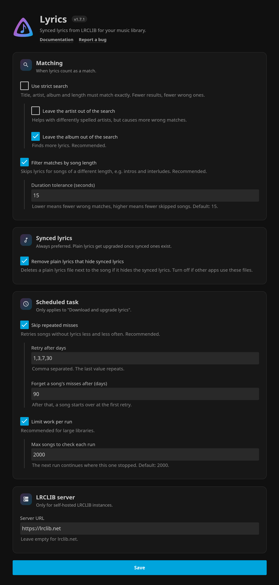

<p align="center">
  
</p>

<h1 align="center">Jellyfin Lyrics Plugin</h1>

<h3 align="center">Lyrics for your whole music library, synced while you listen.</h3>

<p align="center">
  Downloads them automatically from <a href="https://lrclib.net">lrclib.net</a> and shows them in <a href="https://jellyfin.org">Jellyfin</a>'s music player.
</p>

<h5 align="center">
  <a href="#-features">Features</a> |
  <a href="#-installation">Install</a> |
  <a href="https://github.com/Felitendo/jellyfin-plugin-lyrics/issues">Report a bug</a>
</h5>

<p align="center">
  <a href="https://ko-fi.com/felitendo"></a>
</p>

---

## ✨ Features

- 🔄 Automatically downloads lyrics for your entire library  
- 🎼 Seamlessly integrates with Jellyfin’s music player  
- 🌐 Fetches lyrics directly from [lrclib.net](https://lrclib.net)  
- 🏠 Optional self-hosted LRCLIB instance support (advanced)
- 🕒 Real-time lyrics display during playback  
- ⚡ Smarter scheduled task that avoids retrying the same failed songs every day  

---

## 🚀 Installation

1. Make sure your Jellyfin server is on **version 10.11.0 or higher** (Jellyfin 12 is supported too)
2. If jellyfin's **"LrcLib"** plugin (`jellyfin-plugin-lrclib`) is installed, uninstall it first to avoid conflicts:
   - Go to **Dashboard → Plugins → My Plugins**
   - Find **"LrcLib"**, click it, then click **Uninstall** and confirm
   - Restart Jellyfin
3. Add the plugin repository URL to Jellyfin:
   ```
   https://raw.githubusercontent.com/Felitendo/jellyfin-plugin-lyrics/master/manifest.json
   ```
4. Open the **Plugin Catalog** in your Jellyfin dashboard  
5. Look for **"Lyrics"** under the **Metadata** category and install it
6. Restart Jellyfin
7. Go to **Scheduled Tasks** and run **"Download and upgrade lyrics"**
8. Go to **Libraries** and click on **Scan all Libraries**

---

## ⚙️ Settings

All settings are on one page under **Dashboard -> Plugins -> My Plugins -> Lyrics**:

<p align="center">
  
</p>

---

## 🛠️ Troubleshooting

- **Plugin not appearing?**  
  → Double check if your Jellyfin version is **10.11.0 or higher**

- **Lyrics not showing?**  
  → Try to search for songs manually (right click on a song -> edit song text -> click on the search icon)
  → Try **refreshing metadata**

- **Missing lyrics for specific tracks?**  
  → Manually refresh metadata (see below)
  → Toggle the `Use strict search` option in plugin settings
  → If a song with very long trailing silence or a remastered version is being skipped, increase `Duration tolerance (seconds)`

- **Wrong lyrics on instrumental / interlude tracks?**  
  → The plugin filters matches by artist and by duration. If you still see wrong matches, **lower** `Duration tolerance (seconds)` (e.g. `5`) so only very close-duration matches are accepted.
  → If legitimate songs are being skipped instead, **raise** the value (e.g. `30`).

- **Scheduled task takes too long?**  
  → Turn on `Skip repeated misses` (default on)
  → Turn on `Limit work per run` and reduce `Max songs to check each run`
  → Keep `Retry after days` on `1,3,7,30` unless you want faster/slower retries

- **Jellyfin shows plain lyrics although synced ones were downloaded?**  
  → Turn on `Remove plain lyrics that hide synced lyrics` (default), or delete the plain `.txt` next to the song.

## 🔄 Manual Refresh

If lyrics aren't appearing for specific albums:

1. Navigate to the album  
2. Right-click the album  
3. Select **"Refresh metadata"**

---

## 🤝 Contributing

Contributions are welcome!  
Feel free to open a **Pull Request**, or suggest new features / report bugs via an **Issue**.

---

## 📬 Support

👉 [Create an Issue](https://github.com/Felitendo/jellyfin-plugin-lyrics/issues)
